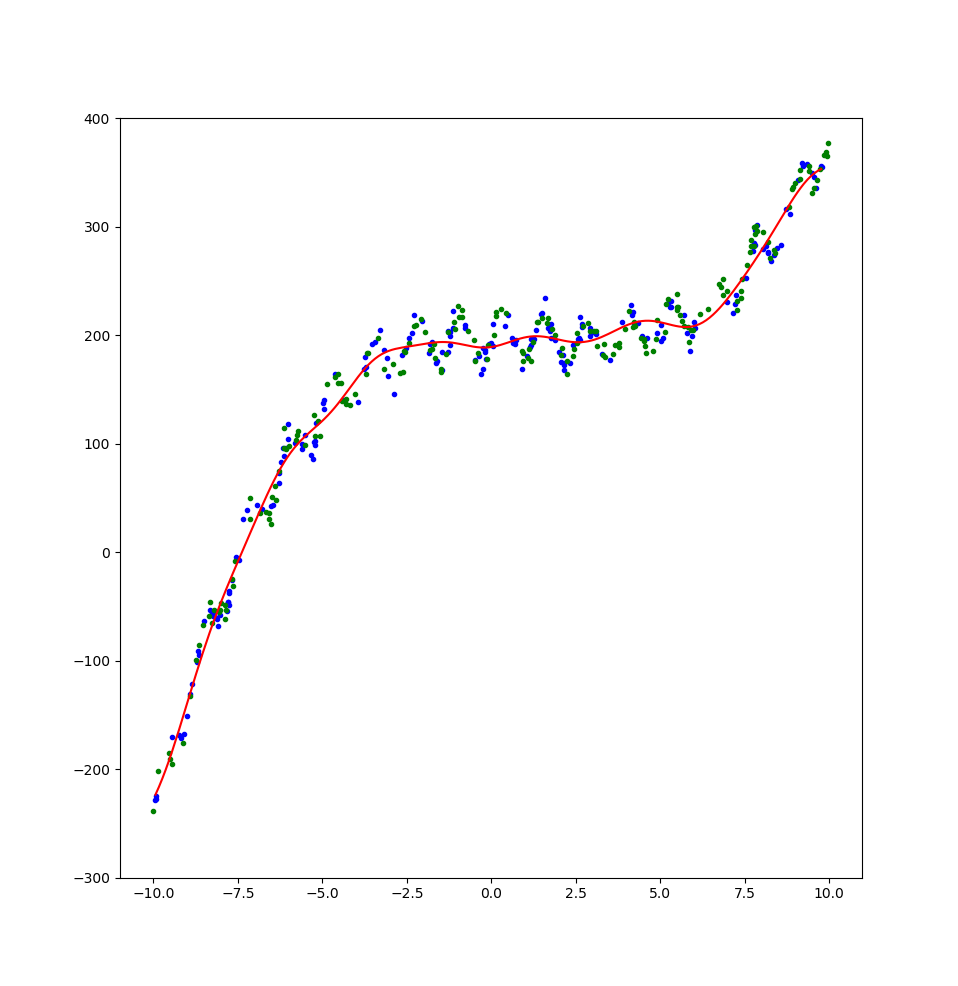
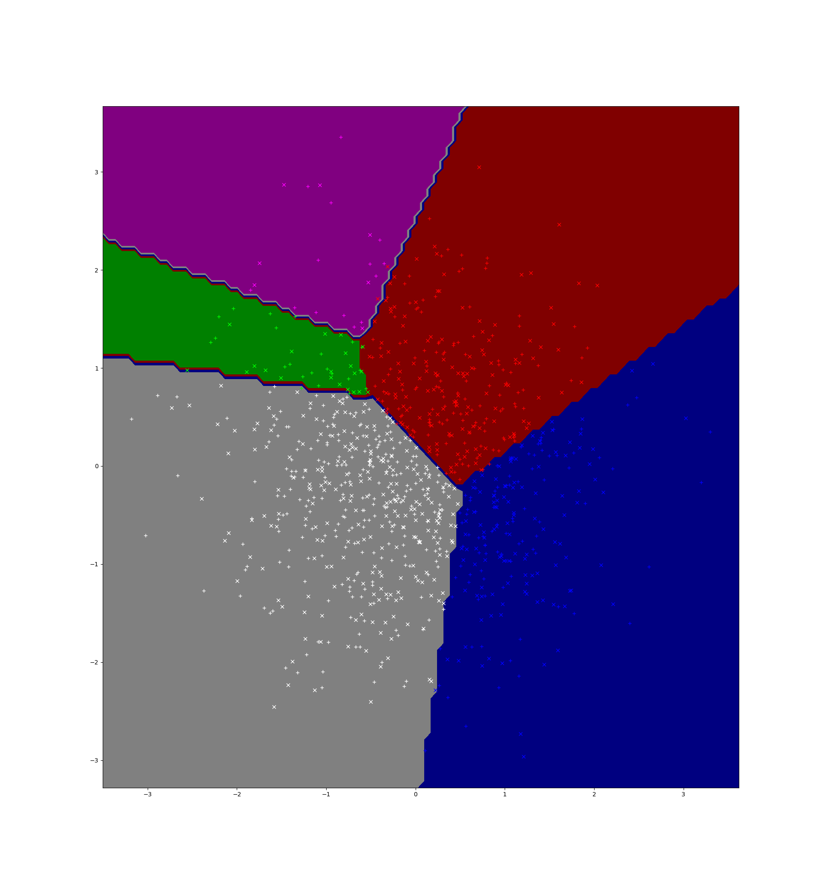

# CPSC 540 Assignment 1

Name: Tristan Rice

Student ID: 25886145

Faculty: Science

Department: Computer Science

## Question 1 - Very-Short Answer Questions

Give a short and concise 1-sentence answer to the below questions.

### 1. Why is the IID assumption important in supervised learning?

Supervised learning works on the principle that the training data is a good
representation of the test data and the IID assumption states that.

### 2. Suppose we have a supervised learning problem where we think the examples xi form clusters. To deal with this, we combine our training and test data together and fit a k-means model. We then add the cluster number as an extra feature, fit our supervised learning model based on the training data, then evaluate it on the test data. What have we done wrong?

We used the test data during training which violates the golden rule.

### 3. What is the difference between a validation set error and the test error?

Validation set error is the error you compute via the validation set where as
test error is the theoretical error if you had infinite test data.

### 4. Describe a setting where using a validation set to choose hyper-parameters can lead to overfitting.

If you are using the validation set to optimize a large number of
hyper-parameter options it's very easy to overfit since you're optimizing for
the validation set error instead of the test error.

### 5. What is the effect of the number of features d that our model uses on the training error and on the approximation error?

Increasing d, exponentially increases the problem space and thus with the same
amount of data can cause overfitting on the training error (lowering it) and
making the approximation error much larger.


### 6. What is wrong with with using 1 n Pn i=1(ˆyi == ˜yi) as the validation error of a regression model?

In regression it's very unlikely that the two numbers will be an exact match and
thus the validation error will be always very close to 0 and thus useless for
telling us how accurate the model is.

### 7. Describe a situation where it could be better to use gradient descent than the normal equations to solve a least squares problem.

If you have a huge amount of data solving the normal equations isn't feasible
since it requires a quadratic+ amount of computational resources due to very
large matrices.

### 8. How does $\lambda$ in an L0-regularizer (like BIC) affect the sparsity pattern of the solution, the training error, and the approximation error?

Increasing $\lambda$ causes the solution to be sparser since there's a higher
penalty on non-zero values, the training error to increase since it can't
overfit as much and lowers the approximation error since the model is likely
more general.

### 9. Minimizing the squared error with L0-regularization is NP-hard, what does this imply?

It's computationally infeasible to find the model with the lowest training error
and approximations are the best we can do.

### 10. For a fixed target y, what is the likely effect of increasing the condition number of X (in a least squares problem) on the approximation error?

Increasing the condition number of X means the problem is less stable and will
have a higher approximation error.

### 11. For supervised training of a linear model w T x i with yi ∈ {−1, +1}, why do we use the logistic loss intead of the squared error?

### 12. What is the key difference between “one vs. all” logistic regression and training using the softmax loss?

### 13. Give a supervised learning scenario where you would use the Laplace likelihood and a scenario where you would use a Laplace prior.

### 14. What do we use the backpropagation algorithm for?

Updating weights in a neural network.

### 15. What are the two key properties of a problem that let us use dynamic programming?

### 16. Consider a deep neural network with 1 million hidden units. Explain whether this is a parametric or a non-parametric model.

This is a parametric model since the amount of memory it uses is constant with a
varying number of training examples.

### 17. What are two reasons that convolutional neural networks overfit less than classic neural networks?

## Question 2 - Calculation Questions

### 2.1

### 2.1.1

### 2.1.2

### 2.1.3

### 2.2

### 2.3

### 2.4

## Question 3 - Coding Questions

### 3.1

#### 3.1.1

\


#### 3.1.2

#### 3.1.3

\


#### 3.1.4

If the period of the oscillations isn't constant, we can transform the data
before hand and put it on a non-linear scale before making using the Gaussian
RBF. That way the RBF sees a constant period, but our data isn't.

If we haven't evenly sampled the training data, but we know the distribution we
can weigh the examples to counterbalance our uneven sampling. This would be
fairly simple to implement by adding a weight to the distance calculated for
each RBF point.


### 3.2


```
trainError = 0.004
validError = 0.026
```

\


### 3.3

TODO
