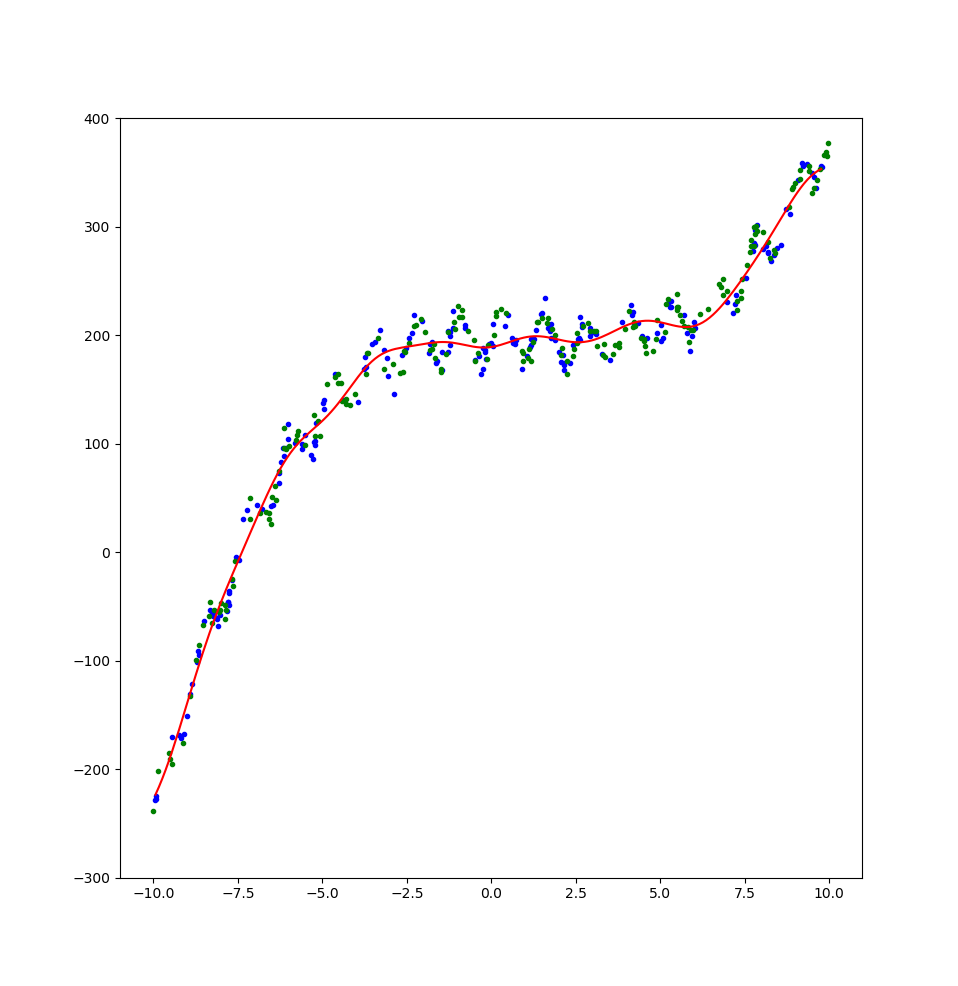
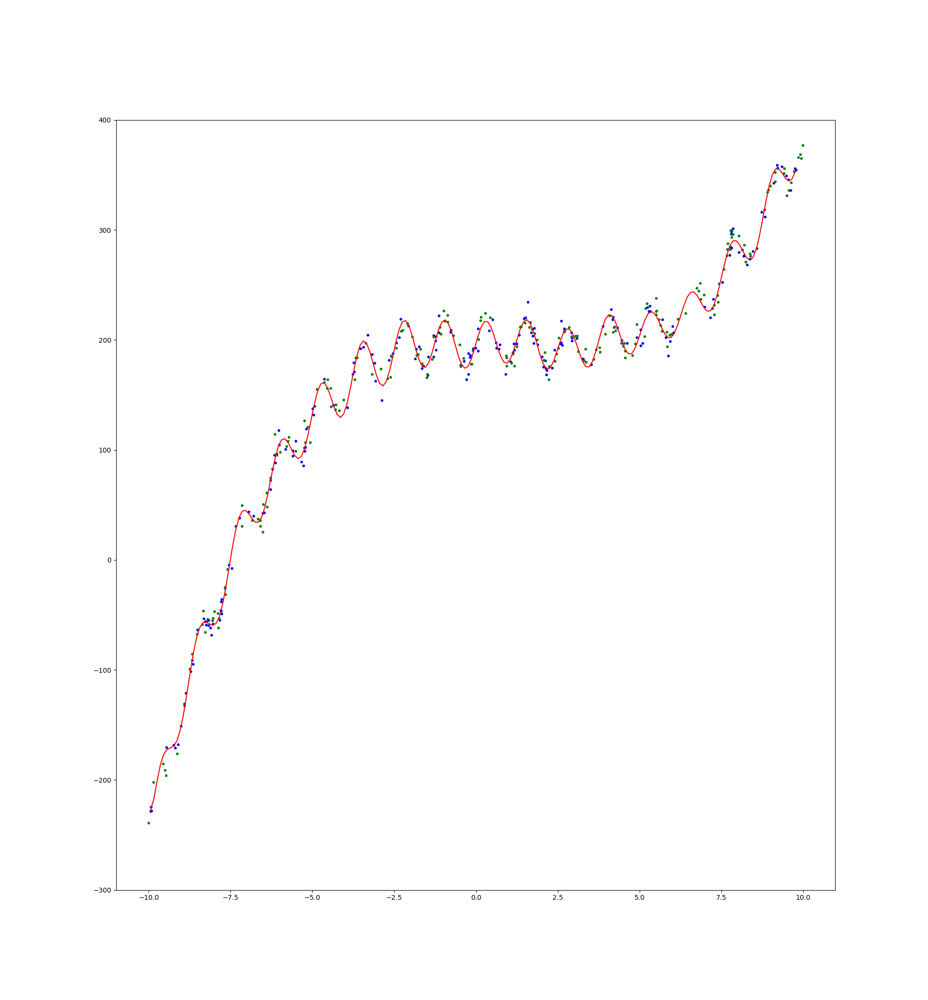
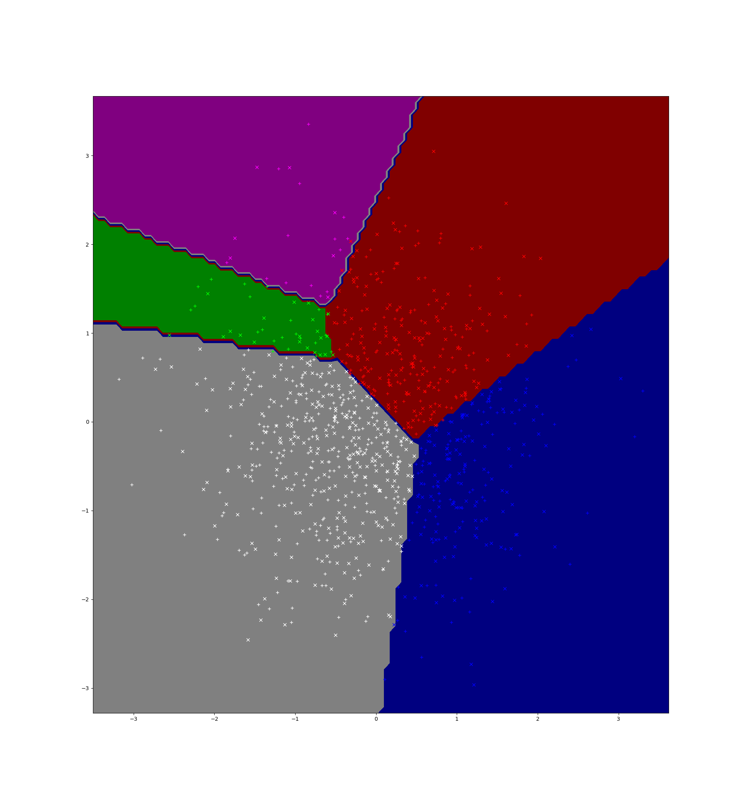
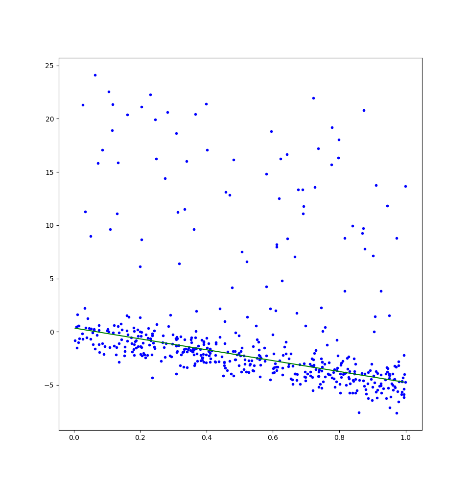
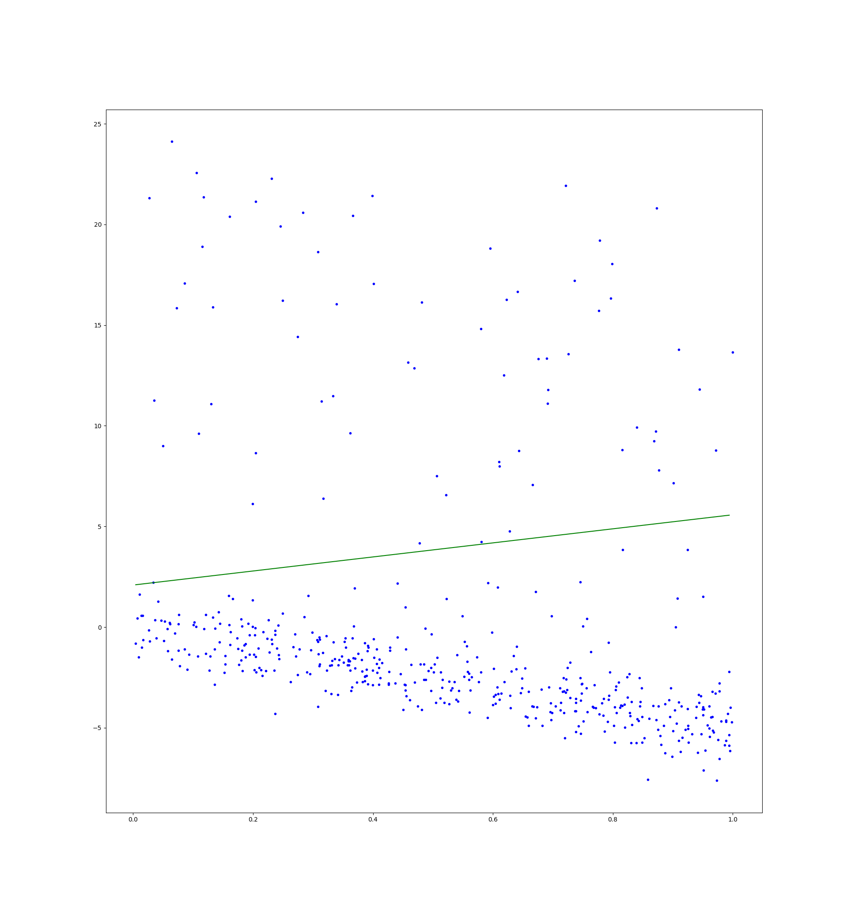

# CPSC 540 Assignment 1

Name: Tristan Rice

Student ID: 25886145

Faculty: Science

Department: Computer Science

## Question 1 - Very-Short Answer Questions

Give a short and concise 1-sentence answer to the below questions.

### 1. Why is the IID assumption important in supervised learning?

Supervised learning works on the principle that the training data is a good
representation of the test data and the IID assumption states that.

### 2. Suppose we have a supervised learning problem where we think the examples xi form clusters. To deal with this, we combine our training and test data together and fit a k-means model. We then add the cluster number as an extra feature, fit our supervised learning model based on the training data, then evaluate it on the test data. What have we done wrong?

We used the test data during training which violates the golden rule.

### 3. What is the difference between a validation set error and the test error?

Validation set error is the error you compute via the validation set where as
test error is the theoretical error if you had infinite test data.

### 4. Describe a setting where using a validation set to choose hyper-parameters can lead to overfitting.

If you are using the validation set to optimize a large number of
hyper-parameter options it's very easy to overfit since you're optimizing for
the validation set error instead of the test error.

### 5. What is the effect of the number of features d that our model uses on the training error and on the approximation error?

Increasing d, exponentially increases the problem space and thus with the same
amount of data can cause overfitting on the training error (lowering it) and
making the approximation error much larger.


### 6. What is wrong with with using ... as the validation error of a regression model?

In regression it's very unlikely that the two numbers will be an exact match and
thus the validation error will be always very close to 0 and thus useless for
telling us how accurate the model is.

### 7. Describe a situation where it could be better to use gradient descent than the normal equations to solve a least squares problem.

If you have a huge amount of data solving the normal equations isn't feasible
since it requires a quadratic+ amount of computational resources due to very
large matrices.

### 8. How does $\lambda$ in an L0-regularizer (like BIC) affect the sparsity pattern of the solution, the training error, and the approximation error?

Increasing $\lambda$ causes the solution to be sparser since there's a higher
penalty on non-zero values, the training error to increase since it can't
overfit as much and lowers the approximation error since the model is likely
more general.

### 9. Minimizing the squared error with L0-regularization is NP-hard, what does this imply?

It's computationally infeasible to find the model with the lowest training error
and approximations are the best we can do.

### 10. For a fixed target y, what is the likely effect of increasing the condition number of X (in a least squares problem) on the approximation error?

Increasing the condition number of X means the problem is less stable and will
have a higher approximation error.

### 11. For supervised training of a linear model ..., why do we use the logistic loss instead of the squared error?

Squared error is more susceptible to outliers than logistic loss causing slower
convergence rates than logistic loss for classification purposes.


### 12. What is the key difference between “one vs. all” logistic regression and training using the softmax loss?

Softmax loss allows for normalization of $w$ across all labels which prevents
issues with one vs. all where sometimes certain classes will never be predicted.

### 13. Give a supervised learning scenario where you would use the Laplace likelihood and a scenario where you would use a Laplace prior.

Laplace likelihood is useful when there are a large amount of outliers since
it's closer to absolute error than something like gaussian which is equivalent
to least squares. Laplace prior is useful when you need more sparsity in the
weights than you can get through gaussian priors.

### 14. What do we use the backpropagation algorithm for?

Updating weights in a neural network.

### 15. What are the two key properties of a problem that let us use dynamic programming?

The problem can be formulated as a recursive combination of "sub-problems" and that there
is a limited overlapping set of sub-problems.

### 16. Consider a deep neural network with 1 million hidden units. Explain whether this is a parametric or a non-parametric model.

This is a parametric model since the amount of memory it uses is constant with a
varying number of training examples.

### 17. What are two reasons that convolutional neural networks overfit less than classic neural networks?

The convolution is reused and thus must be more general and it uses fewer total
weights and thus has a smaller chance of overfitting.

## Question 2 - Calculation Questions

### 2.1

#### 2.1.1

$$f(w) = \frac{1}{2}(w-u)^T \Sigma (w-u)$$

$$\Sigma = G^TG$$

$$f(w) = \frac12(G(w-u))^2$$

$$f'(w) = G(w-u)G$$

$$0 = G(w-u)G$$

$$GwG = GuG$$

$$w = u$$

#### 2.1.2

$$f'(w) = \frac{||Xw-y||}{\sigma ^2} \frac{Xw-y}{||Xw-y||} + \lambda ||w||\frac{w}{||w||}$$

$$f'(w) = \frac{Xw-y}{\sigma ^2} + \lambda w$$

$$f'(w) = (\frac{X}{\sigma ^2}-\lambda I)w - \frac{y}{\sigma ^2}$$

$$0 = (\frac{X}{\sigma ^2}-\lambda I)w - \frac{y}{\sigma ^2}$$

$$w = (\frac{X}{\sigma ^2}-\lambda I)^{-1} \frac{y}{\sigma ^2}$$

#### 2.1.3

$$f'(w) = \sum_{i=1}^n v_i(w^Tx^i-y^i)x^i + \Lambda w - \Lambda u$$

$$f'(w) = w^T\sum_{i=1}^n v_i{x^i}^2-\sum_{i=1}^n v_iy^ix^i + \Lambda w - \Lambda u$$
$$f'(w) = (\sum_{i=1}^n v_i{x^i}^2 + \Lambda)w -\sum_{i=1}^n v_iy^ix^i  - \Lambda u = 0$$
$$w = (\sum_{i=1}^n v_i{x^i}^2 + \Lambda)^-1(\sum_{i=1}^n v_iy^ix^i  + \Lambda u)$$

### 2.2

#### 2.2.1

$$||w||_\infty \leq ||w||_2$$

$$max_i w_i \leq \sqrt{w_0^2 + w_1^2 + \ldots}$$

$$\sqrt{(max_i w_i)^2} \leq \sqrt{w_0^2 + w_1^2 + \ldots}$$
$$(max_i w_i)^2 \leq w_0^2 + w_1^2 + \ldots$$

Since the max element of $w$ is included in both sides and all the
squared terms are positive, the right side must be greater or equal to the left
hand side.

$$||w||_2 \leq ||w||_1$$

$$\sqrt{w_0^2 + w_1^2 + \ldots} \leq |w_0| + |w_1| + \ldots$$

$$w_0^2 + w_1^2 + \ldots \leq (|w_0| + |w_1| + \ldots)^2$$

$$w_0^2 + w_1^2 + \ldots \leq w_0^2 + 2|w_0||w_1| + w_1^2 + \ldots$$

Thus, both sides contain the $w_i^2$ elements and thus the right side must be
greater or equal due to the $2|w_i||w_j|$ elements which are all positive.

#### 2.2.2

$$||w||_1 \leq \sqrt{d}||w||_2$$

$$|w_0| + |w_1| + \ldots \leq \sqrt{d}\sqrt{w_0^2 + w_1^2 + \ldots}$$
$$(|w_0| + |w_1| + \ldots)^2 \leq d(w_0^2 + w_1^2 + \ldots)$$

$$w_0^2 + 2|w_0||w_1| + w_1^2 + \ldots \leq d(w_0^2 + w_1^2 + \ldots)$$

$$2|w_0||w_1| + \ldots \leq (d-1)(w_0^2 + w_1^2 + \ldots)$$

We see on the left side there are $\frac{d(d-1)}{2}$ terms.

$$2|w_0||w_1| + \ldots \leq (d-1)(w_0^2 + w_1^2 + \ldots)$$

We can complete the square, since there are $d-1$ occurences of each
variable on the left hand side and $d-1$ squared terms of it on the right.
$$0 \leq \sum_{i=1}^d \sum_{j=i+1}^d (w_i - w_j)^2 $$

Since all the terms on the right are squared, they must be positive and the
inequality holds.


$$\sqrt{d} ||w||_2 \leq d ||w||_\infty$$

$$d ||w||_2^2 \leq d^2 ||w||_\infty$$
$$||w||_2^2 \leq d ||w||_\infty^2$$

$$w_1 + w_2 + \ldots \leq d \max_i w_i^2$$

Every $w_i^2 \leq \max_i w_i^2$, thus, this inequality holds.


#### 2.2.3

$$\frac{1}{2}((w_1+u_1)^2 + (w_2+u_2)^2 + \ldots) \leq ||w||^2+||u||^2$$
$$w_1^2+2w_1u_1 +u_1^2 + w_2^2+2w_2u_2 + u_2^2 + \ldots \leq 2(||w||^2+||u||^2)$$

The squared terms on the left equal ($||w||^2+||u||^2$).

$$2w_1u_1 + 2w_2u_2 + \ldots \leq ||w||^2+||u||^2$$

$$2w_1u_1 + 2w_2u_2 + \ldots \leq w_1^2 + u_1^2 + w_2^2 + u_2^2 + \ldots$$

$$0 \leq (w_1^2 - 2w_1u_1 + u_1^2) + (w_2^2 - 2w_2u_2 + u_2^2) + \ldots$$

Completing the square gets us

$$0 \leq (w_1 - u_1)^2 + (w_2 - u_2)^2 + \ldots$$

Since all the terms on the right hand side are squared they must be positive and
thus $\geq 0$. Thus, the inequality holds.


### 2.3

#### 2.3.1

Laplace distribution
$$f(x|\mu, b) = \frac{1}{2b} \exp(-\frac{|x-\mu|}{b})$$

Gaussian distribution
$$f(x|\mu, \sigma) = \frac{1}{\sqrt{w\pi\sigma}}
\exp(-\frac{-\frac{(x-\mu)^2}{2\sigma^2}}{b})$$

$$f(x) = -\sum_{i=1}^n \log(p(y^i|x^i,w))
 - \sum_{j=1}^n \log(p(w^j))$$

$$f(x) = -\sum_{i=1}^n (\log(\frac{1}{\sqrt{2\pi \sigma _i^2}})
 - \frac{(w^Tx^i-y^i)^2}{2\sigma_i^2})
 - \sum_{j=1}^n (\log(\frac{\lambda}{2}) - \lambda|w_j|)$$

We can then discard any constants.

$$f(x) = -\sum_{i=1}^n (\log(\frac{1}{\sqrt{2\pi \sigma _i^2}})
 - \frac{(w^Tx^i-y^i)^2}{2\sigma_i^2})
 + \sum_{j=1}^n  \lambda|w_j|)$$

#### 2.3.2

$$f(x) = -\sum_{i=1}^n \log(p(y^i|x^i,w))
 - \sum_{j=1}^n \log(p(w^j))$$


$$f(x) = -\sum_{i=1}^n
\log(
\frac{1}{\sqrt{\nu}\Beta(\frac12, \frac{\nu}2)}
(1+\frac{(w^Tx^i-y^i)^2}{\nu})^{-\frac{\nu+1}2}
)
 + \sum_{j=1}^n \frac{\lambda(w_j-u_j)^2}{2}$$

$$f(x) = -\sum_{i=1}^n
-\frac{\nu+1}2
\log(
1+\frac{(w^Tx^i-y^i)^2}{\nu})
)
 + \sum_{j=1}^n \frac{\lambda(w_j-u_j)^2}{2}$$

#### 2.3.3

$$f(x) = -\sum_{i=1}^n \log(p(y^i|x^i,w))
 - \sum_{j=1}^n \log(p(w^j))$$

$$f(x) = -\sum_{i=1}^n
\log(
\exp(v^iw^Tx^i)\exp(-y^i\exp(w^Tx^i))
)
+ \sum_{j=1}^n \frac{\lambda_j w_j^2}{2}$$

$$f(x) = -\sum_{i=1}^n  (
v^iw^Tx^i - y^i\exp(w^Tx^i)
)
+ \sum_{j=1}^n \frac{\lambda_j w_j^2}{2}$$

### 2.4

#### 2.4.1

$$f(w) = w^Tu+u^TAw + \frac12 w^Tw + w^TAw$$

$$\nabla f(w) = u+u^TA + w + (A + A^T)w$$
$$\nabla^2 f(w) = I + A + A^T$$

#### 2.4.2


$$f(w) = \frac12 (w^Tx -y)^TV(w^T x-y) + \frac12 w^T \Lambda w$$

$$\nabla f(w) = V(w^T x-y)x + \frac12 (\Lambda^T + \Lambda)w$$
$$\nabla^2 f(w) = Vxx + \frac12 (\Lambda^T + \Lambda)$$

#### 2.4.3


$$c_i = \Phi(y^iw^Tx^i)$$

$U$ is a $d \times d$ matrix with $u$ on it's diagonal.

$$f(w) = -\sum_{i=1}^n \log c_i + \frac12 w^T U w$$

The derivative of the CDF is the PDF.

$$p_i = \phi(y^iw^Tx^i)$$

$p_i$ is a vector of the partial derivatives of $w$.

$$\nabla f(w) = -(\frac{1}{c})^T p + U w$$

$$\nabla^2 f(w) = -(\frac{1}{c})^T \nabla p + U$$

$$p = \frac{1}{\sqrt{2\pi}}\exp(-\frac{(yw^Tx)^2}{2})$$
$$\nabla p = \frac{1}{\sqrt{2\pi}}\exp(-\frac{(yw^Tx)^2}{2})(-yw^Tx)(yx)$$

$$\nabla^2 f(w) = -(\frac{1}{c})^T \frac{1}{\sqrt{2\pi}}\exp(-\frac{(yw^Tx)^2}{2})(-yw^Tx)(yx) + U$$

## Question 3 - Coding Questions

### 3.1

#### 3.1.1

\


leastSquaresRBFL2.jl
```julia
include("misc.jl")

function rbfBasis(X1, X2, sigma)
  return exp.(-distancesSquared(X1,X2)/(2*sigma^2))
end

function leastSquaresRBFL2(X, y, l, sigma)
	# Make RBF basis
	n = size(X,1)
	Z = rbfBasis(X, X, sigma)

	# Find regression weights minimizing squared error with L2 regularization
	w = (Z'*Z + eye(size(Z,2))*l)\(Z'*y)

	display(size(w))

	# Make linear prediction function
	predict(Xtilde) = rbfBasis(Xtilde, X, sigma)*w

	# Return model
	return LinearModel(predict,w)
end
```

#### 3.1.2

Training:

Linear basis: The dominating computations are computing `X' * X` which takes
$O(nd^2)$ and inverting a matrix which takes roughly $O(d^3)$. Thus, for
training the runtime is roughly $O(d^2(n+d))$. Classifying t examples is just
$O(td)$.

RBF basis: Computing the basis takes $O(n^2 d)$ time and produces a matrix of
size $n \times n$. Thus, squaring it takes $O(n^3)$ and solving the system takes
$O(n^3)$. Overall training is $O(n^3)$. Prediction takes $O(ntd)$ to compute the basis and $O(tn)$ to apply
the model, thus $O(ntd)$.


#### 3.1.3

\


example_nonLinear.jl
```julia
# Load X and y variable
using JLD
data = load("nonLinear.jld")
(X,y,Xtest,ytest) = (data["X"],data["y"],data["Xtest"],data["ytest"])

# Compute number of training examples and number of features
(n,d) = size(X)

display(size(X))

ntrain = Int(floor(n/2))

Xtrain = X[1:ntrain, :]
ytrain = y[1:ntrain, :]
Xvalidate = X[ntrain+1:n, :]
yvalidate = y[ntrain+1:n, :]

display(size(Xtrain))
display(size(Xvalidate))

# Fit least squares model
#include("leastSquares.jl")
#model = leastSquares(X,y)


bestError = 10000000000000000
bestl = 0
bestsigma = 0

include("leastSquaresRBFL2.jl")

# Find best l, sigma values
for l = 0:0.1:3
  for sigma = 0.1:0.1:3
		model = leastSquaresRBFL2(Xtrain,ytrain,l, sigma)

		# Report the error on the validation set
		t = size(Xvalidate,1)
		yhat = model.predict(Xvalidate)
		validationError = sum((yhat - yvalidate).^2)/t
		@printf("l = %f, sigma = %f, ValidationError = %.2f\n", l, sigma, validationError)
    if validationError < bestError
      bestError = validationError
      bestl = l
      bestsigma = sigma
    end
  end
end

@printf("Best validation l = %f, sigma = %f, error = %f", bestl, bestsigma, bestError)

model = leastSquaresRBFL2(X,y,bestl,bestsigma)

# Report the error on the test set
t = size(Xtest,1)
yhat = model.predict(Xtest)
testError = sum((yhat - ytest).^2)/t
@printf("l = %f, sigma = %f, TestError = %.2f\n", bestl, bestsigma, testError)


# Plot model
using PyPlot
figure()
plot(X,y,"b.")
plot(Xtest,ytest,"g.")
Xhat = minimum(X):.1:maximum(X)
Xhat = reshape(Xhat,length(Xhat),1) # Make into an n by 1 matrix
yhat = model.predict(Xhat)
plot(Xhat,yhat,"r")
ylim((-300,400))
show()
```

#### 3.1.4

If the period of the oscillations isn't constant, we can transform the data
before hand and put it on a non-linear scale before making using the Gaussian
RBF. That way the RBF sees a constant period, but our data isn't.

If we haven't evenly sampled the training data, but we know the distribution we
can weigh the examples to counterbalance our uneven sampling. This would be
fairly simple to implement by adding a weight to the distance calculated for
each RBF point.


### 3.2


```
trainError = 0.004
validError = 0.026
```

\


### 3.3

#### 3.3.1


leastAbsolutes.jl
```julia
using MathProgBase, GLPKMathProgInterface

include("misc.jl")

function leastAbsolutes(X, y)
  (n, d) = size(X)
  X = [ones(n, 1) X]
  d += 1
  y = y[:,1]
  c = [ones(n); zeros(d)]
  A = [eye(n) -X; eye(n) X]
  b = [-y; y]

  display(size(y))
  display(size(c))
  display(size(A))
  display(size(b))

  l = [zeros(n); ones(d) * -Inf]

  sol = linprog(c, A, '>', b, l, Inf, GLPKSolverLP())
  w = sol.sol[n+1:n+d]
  if sol.status == :Optimal
      println("Optimal objective value is $(sol.objval)")
      println("Optimal solution vector is: $(w)")
  else
      println("Error: solution status $(sol.status)")
  end
  predict(Xtilde) = [ones(size(Xtilde,1),1) Xtilde]*w

  # Return model
  return LinearModel(predict, w)
end
```

\


#### 3.3.2

Expanding the L-infinity norm gets an objective function of:

$$\min{w} \sum_{i=1}^n \max_j\{|w_j x^i_j - y^i|\}$$

We can replace the max with $d$ constraints and a dummy variable that must be
larger than all the possible values of $w_j x^i_j-y^i$.

$$\min{w, r} \sum_{i=1}^n r_i, r_i \geq |w_j x^i_j -y^i| \forall i, j$$
$$\min{w, r} \sum_{i=1}^n r_i,
r_i \geq w_j x^i_j -y^i,
r_i \geq y^i - w_j x^i_j
\forall i, j$$

#### 3.3.3

leastMax.jl
```julia
using MathProgBase, GLPKMathProgInterface

include("misc.jl")

function leastMax(X, y)
  (n, d) = size(X)
  X = [ones(n, 1) X]
  d += 1
  y = y[:,1]
  c = [ones(n); zeros(d)]
  A = zeros(0, d + n)
  b = Float64[]

  for j = 1:d
    colj = zeros(d, d)
    colj[j,j] = 1
    A = [A; eye(n) X*colj; eye(n) -X*colj]
    b = [b; -y; y]
  end

  display(size(y))
  display(size(c))
  display(size(A))
  display(size(b))

  l = [zeros(n); ones(d) * -Inf]

  sol = linprog(c, A, '>', b, l, Inf, GLPKSolverLP())
  w = sol.sol[n+1:n+d]
  if sol.status == :Optimal
      println("Optimal objective value is $(sol.objval)")
      println("Optimal solution vector is: $(w)")
  else
      println("Error: solution status $(sol.status)")
  end
  predict(Xtilde) = [ones(size(Xtilde,1),1) Xtilde]*w

  # Return model
  return LinearModel(predict, w)
end
```

\


